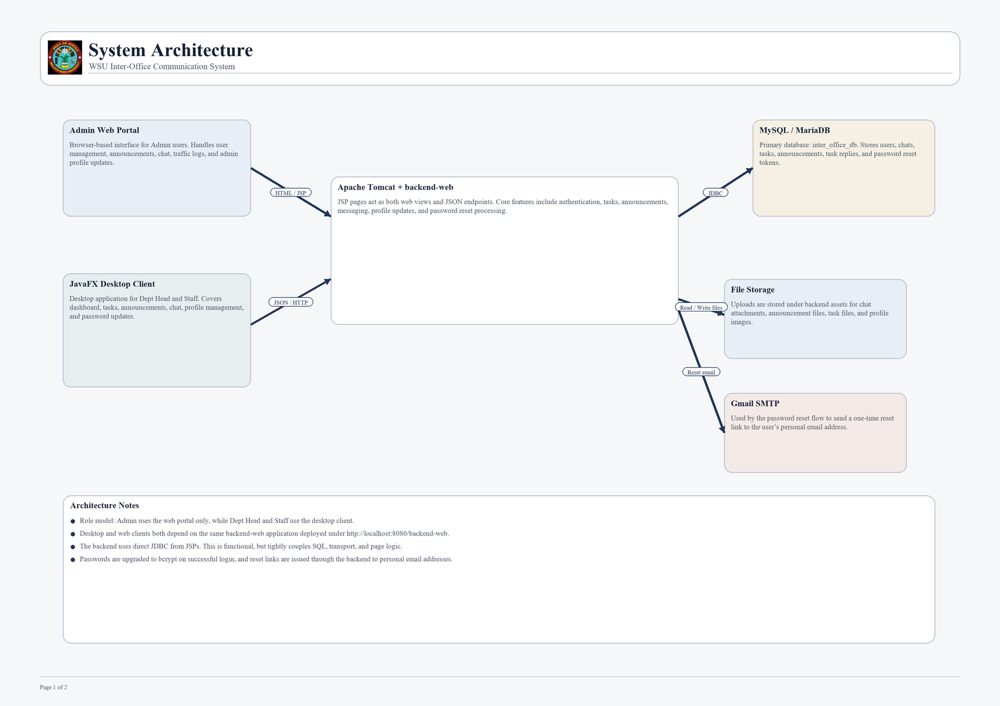
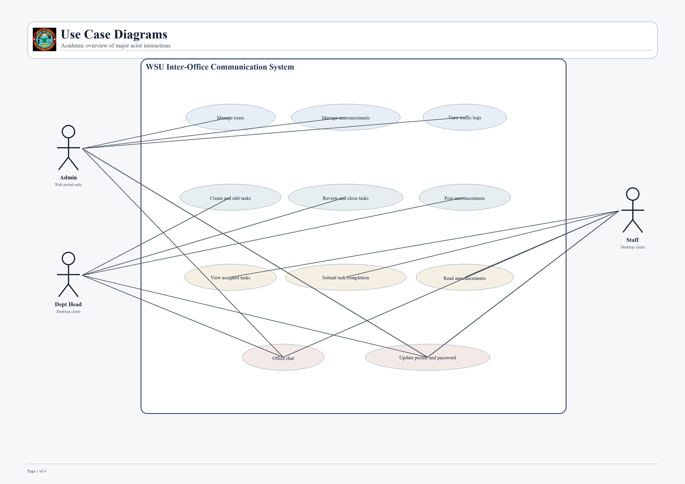
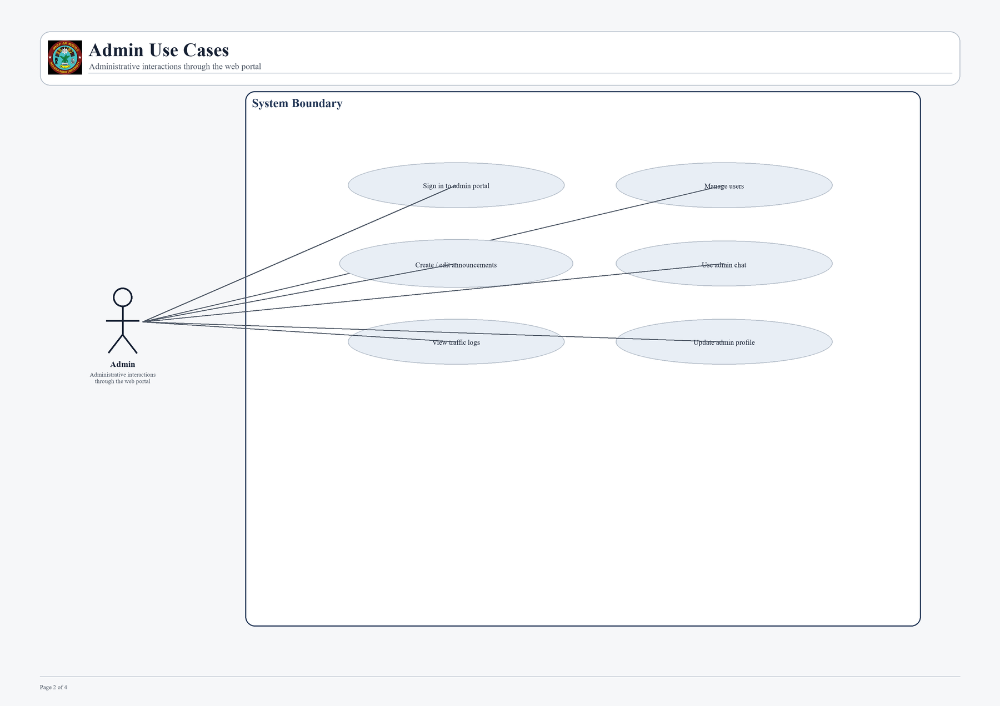
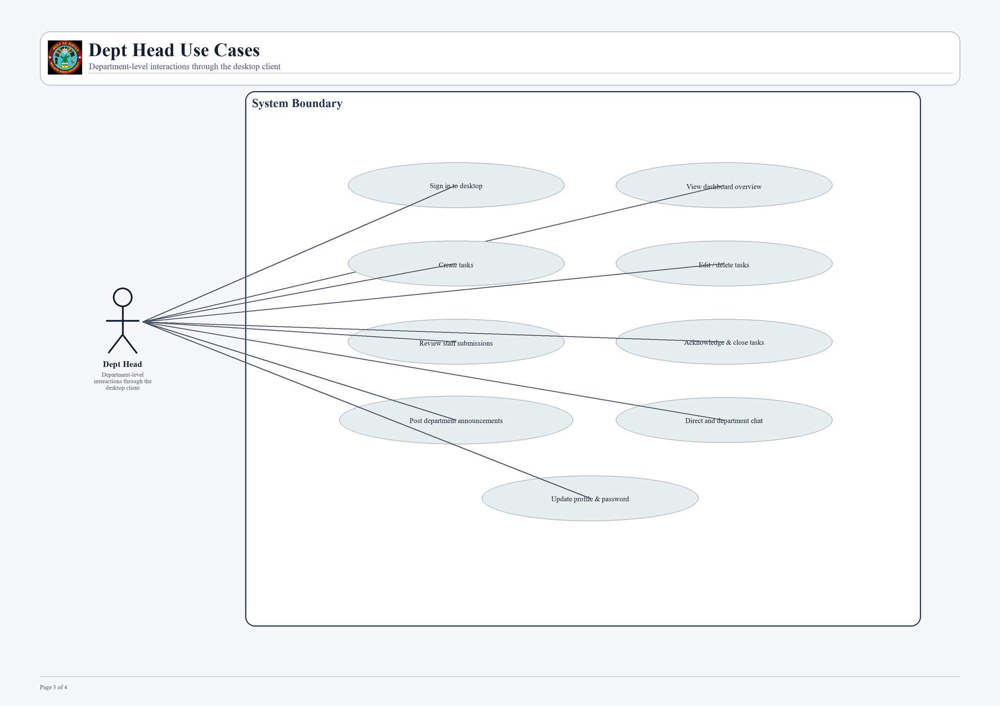
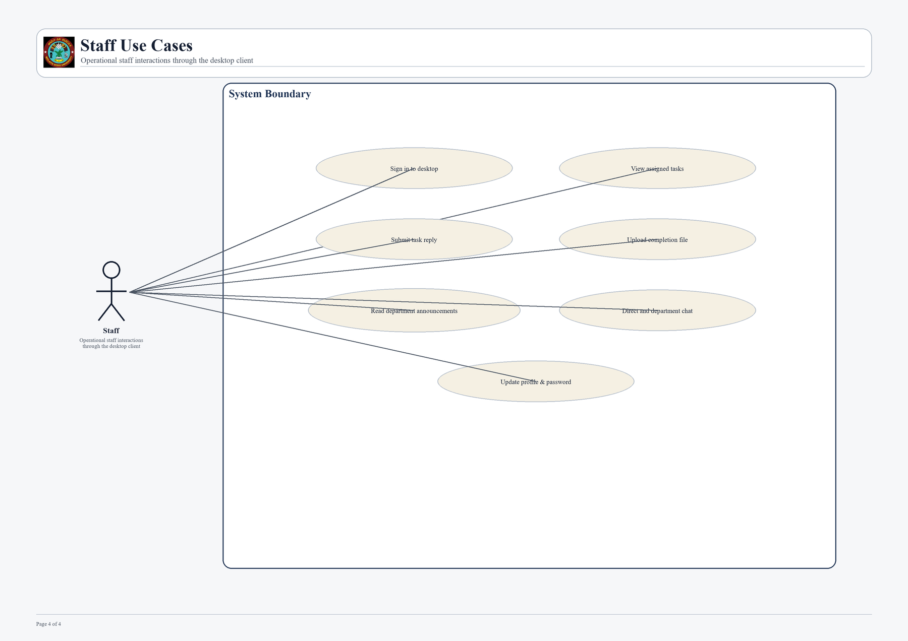

# WSU Inter-Office Communication System

Inter-Office Communication System for Wolaita Sodo University, built with a JSP/Tomcat backend and a JavaFX desktop client.

## Overview

This project supports day-to-day communication and coordination across university offices. It combines:

- a web-based admin portal for user and system administration
- a JavaFX desktop application for department heads and staff
- a shared backend that serves HTML views, JSON APIs, file uploads, and password reset workflows

## Role Model

- `Admin`: uses the web portal only
- `Dept Head`: uses the desktop client
- `Staff`: uses the desktop client

## Core Features

- Role-based authentication
- Admin user management
- Task assignment, review, and acknowledgement
- Department announcements
- Office chat with file attachments
- Profile management with profile photo support
- Password reset through personal email
- Traffic log viewing for admin users

## Architecture

- `backend-web`: JSP-based web application deployed on Apache Tomcat
- `frontend-desktop`: JavaFX client for operational users
- `MySQL / MariaDB`: relational data store
- `SMTP`: email delivery for password reset links

Main runtime base URL:

```text
http://localhost:8080/backend-web
```

Primary web entry points:

- `http://localhost:8080/backend-web/index.jsp`
- `http://localhost:8080/backend-web/admin/login.jsp`

## Documentation Previews

### System Architecture



### Use Case Overview



### Actor-Specific Use Cases







## Project Structure

```text
backend-web/
frontend-desktop/
docs/
README.md
```

## Local Setup

### Backend

1. Install Java and Apache Tomcat.
2. Create or import the database using `docs/inter_office_db (4).sql`.
3. Deploy `backend-web` to Tomcat under `http://localhost:8080/backend-web`.
4. Configure password reset email in `backend-web/src/main/webapp/WEB-INF/mail.properties`.
5. Start from `backend-web/src/main/webapp/WEB-INF/mail.properties.example` for the mail template.

### Desktop

1. Install Java 17.
2. Open `frontend-desktop` in your IDE.
3. Confirm the backend is reachable at `http://localhost:8080/backend-web`.
4. Run the JavaFX client from `frontend-desktop/src/main/java/com/frontenddesktop/MainApp.java`.

## Documentation

- [System Documentation](docs/SYSTEM_DOCUMENTATION.md)
- [System Architecture PDF](docs/System_Architecture.pdf)
- [Use Case Diagrams PDF](docs/Use_Case_Diagrams.pdf)
- [Release Notes Draft](docs/RELEASE_NOTES_v1.0.0.md)

The diagram assets can be regenerated with:

```powershell
python docs/generate_diagram_pdfs.py
```

## Security Notes

- Do not commit real SMTP credentials.
- Do not commit live Tomcat deployment files.
- Do not commit generated packaging output or built artifacts.
- `mail.properties` is intentionally ignored by Git and should stay local.

## Repository Status

This repository currently includes:

- source code for both backend and desktop clients
- documentation markdown and PDF diagrams
- SQL schema/data dump used by the system
- GitHub-ready documentation previews for the main architectural diagrams

## Author

Eyasu Mathewos Michael
